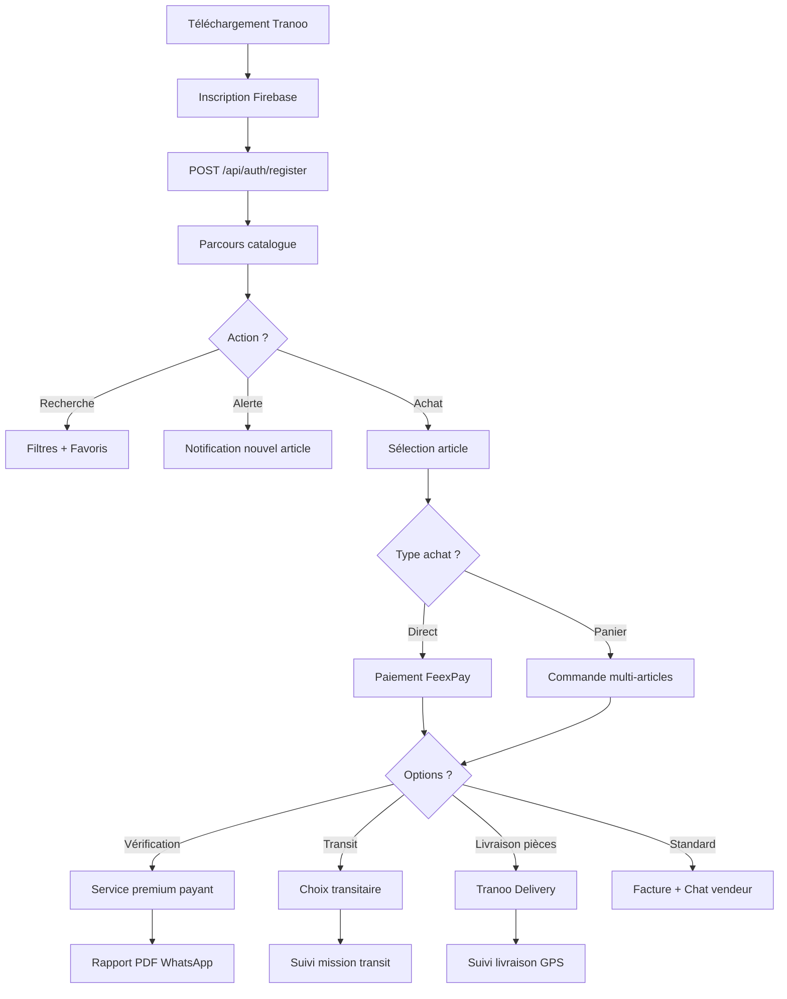
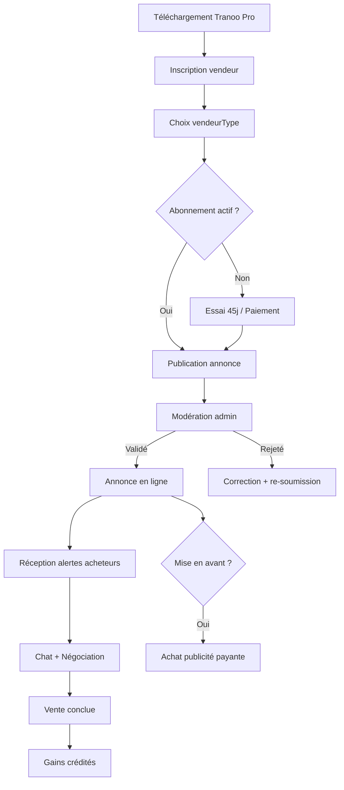
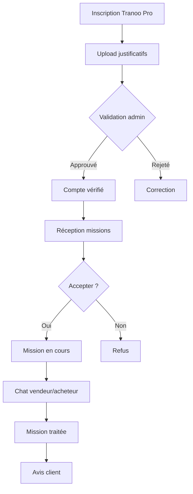
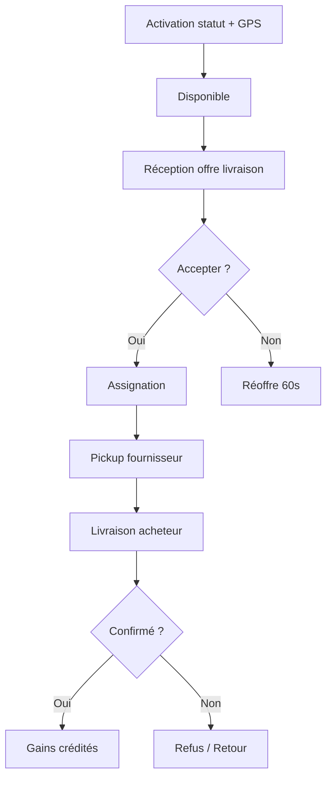

# Tranoo — Description détaillée du produit

**Document destiné aux partenaires**  
**Écosystème :** Tranoo — Marketplace automobile Afrique de l'Ouest  
**Marché principal :** Bénin  
**API production :** `https://api.tranoo.store`  
**Documentation API :** `https://api.tranoo.store/api-docs`  
**Dernière mise à jour :** septembre 2026

---

## Table des matières

1. [Résumé exécutif](#1-résumé-exécutif)
2. [Contexte et positionnement](#2-contexte-et-positionnement)
3. [Proposition de valeur](#3-proposition-de-valeur)
4. [Écosystème produit](#4-écosystème-produit)
5. [Utilisateurs et rôles](#5-utilisateurs-et-rôles)
6. [Fonctionnalités détaillées](#6-fonctionnalités-détaillées)
7. [Parcours utilisateurs](#7-parcours-utilisateurs)
8. [Architecture technique](#8-architecture-technique)
9. [Intégrations et services tiers](#9-intégrations-et-services-tiers)
10. [Modèle économique](#10-modèle-économique)
11. [Données, sécurité et conformité](#11-données-sécurité-et-conformité)
12. [Internationalisation](#12-internationalisation)
13. [Annexes](#13-annexes)

---

## 1. Résumé exécutif

**Tranoo** est une **marketplace automobile full-stack** couvrant l'ensemble du cycle de vie d'un achat ou d'une vente de véhicules, motos et pièces détachées en Afrique de l'Ouest, avec une implantation forte au **Bénin**.

La plateforme permet de :

- **Découvrir et publier des annonces** (voitures, motos, pièces détachées)
- **Acheter et vendre** en toute sécurité via paiement mobile (FeexPay)
- **Vérifier physiquement un véhicule** avant achat (service premium payant)
- **Gérer le transit international** via un réseau de transitaires certifiés
- **Livrer des pièces** localement via Tranoo Delivery (livreurs géolocalisés)
- **Mobiliser des chauffeurs / tricycles** à proximité de l'acheteur
- **Monétiser l'activité vendeur** via abonnements, publicités et commissions

L'écosystème repose sur **quatre composants** intégrés :

| Composant | Technologie | Cible |
|-----------|-------------|-------|
| **API backend** | Node.js / Express / MongoDB | Cœur métier, REST + WebSocket |
| **Tranoo** (mobile) | Flutter v2.0.0 | Acheteurs |
| **Tranoo Pro** (mobile) | Flutter v1.0.2 | Vendeurs, transitaires, livreurs, chauffeurs, agents |
| **Site vitrine + Dashboard admin** | Next.js 15 | Grand public + administration |

---

## 2. Contexte et positionnement

### 2.1 Marché cible

| Critère | Détail |
|---------|--------|
| **Zone géographique** | Afrique de l'Ouest (focus Bénin) |
| **Devise** | XOF (FCFA) |
| **Paiements** | Mobile Money (MTN, Moov, Celtiis BJ, Coris, Orange SN…) + carte bancaire via FeexPay |
| **Langues** | Français, Anglais, Arabe |
| **Géographie intégrée** | Départements, communes, villes et quartiers du Bénin |

### 2.2 Positionnement produit

Tranoo se positionne comme une **plateforme B2B2C automobile** à l'intersection de :

- la **marketplace classique** (annonces, recherche, favoris, achat),
- les **services à valeur ajoutée** (vérification véhicule, transit, livraison),
- la **mobilité locale** (chauffeurs / tricycles géolocalisés),
- un **réseau commercial terrain** (agents commerciaux, parrainage).

### 2.3 Slogan et promesse

> *« Achetez ou vendez votre véhicule en quelques clics »*  
> — Site vitrine Tranoo

> *« Tranoo — Trouvez vos pièces et véhicules rapidement »*  
> — Application mobile acheteur

---

## 3. Proposition de valeur

### 3.1 Pour les acheteurs (Tranoo)

| Bénéfice | Description |
|----------|-------------|
| **Catalogue riche** | Voitures, motos et pièces détachées avec filtres avancés |
| **Confiance** | Service de vérification physique payant avec rapport PDF |
| **Transit simplifié** | Accompagnement import/export via transitaires certifiés |
| **Livraison locale** | Tranoo Delivery pour les pièces commandées |
| **Alertes personnalisées** | Notifications lors de nouvelles annonces correspondant aux critères |
| **Communication directe** | Chat temps réel avec vendeurs et transitaires |

### 3.2 Pour les vendeurs (Tranoo Pro)

| Bénéfice | Description |
|----------|-------------|
| **Visibilité** | Publication d'annonces avec options de mise en avant (À la une, Sponsorisé) |
| **Gestion commerciale** | Suivi stock, statut de vente, portefeuille |
| **Monétisation** | Grille de gains par paliers de prix véhicule |
| **Réseau professionnel** | Chat avec transitaires, alertes acheteurs intéressés |
| **Essai gratuit** | 45 jours d'essai Tranoo Pro par défaut |

### 3.3 Pour les partenaires institutionnels

Tranoo offre un **écosystème numérique structuré** pour :

- connecter concessionnaires, garages et revendeurs à une base d'acheteurs qualifiés,
- sécuriser les transactions via paiement intégré et vérification véhicule,
- faciliter l'import/export via un réseau de transitaires vérifiés,
- déployer un réseau d'agents commerciaux terrain avec suivi GPS,
- administrer l'ensemble via un dashboard web granulaire par rôles.

---

## 4. Écosystème produit

```
┌─────────────────────────────────────────────────────────────────────┐
│                        ÉCOSYSTÈME TRANOO                              │
├─────────────────────────────────────────────────────────────────────┤
│                                                                     │
│  ┌──────────────┐  ┌──────────────┐  ┌──────────────────────────┐  │
│  │   Tranoo     │  │  Tranoo Pro  │  │  Site vitrine + Admin    │  │
│  │  (Acheteur)  │  │  (Pros)      │  │  (Next.js)               │  │
│  │  Flutter     │  │  Flutter     │  │  Landing + Dashboard     │  │
│  └──────┬───────┘  └──────┬───────┘  └────────────┬─────────────┘  │
│         │                 │                        │                │
│         └─────────────────┼────────────────────────┘                │
│                           │ REST + WebSocket                          │
│                           ▼                                           │
│              ┌────────────────────────────┐                          │
│              │     API Tranoo (Node.js)   │                          │
│              │  api.tranoo.store          │                          │
│              │  MongoDB + Socket.io       │                          │
│              └────────────────────────────┘                          │
│                           │                                           │
│         ┌─────────────────┼─────────────────┐                        │
│         ▼                 ▼                 ▼                        │
│   ┌──────────┐     ┌──────────┐      ┌──────────┐                   │
│   │ FeexPay  │     │ Firebase │      │Cloudinary│                   │
│   │ Paiement │     │ Auth/FCM │      │ Médias   │                   │
│   └──────────┘     └──────────┘      └──────────┘                   │
│         │                 │                 │                        │
│   ┌──────────┐     ┌──────────┐      ┌──────────┐                   │
│   │ WhatsApp │     │ Botpress │      │ Turnstile│                   │
│   │ Business │     │ Chatbot  │      │ CAPTCHA  │                   │
│   └──────────┘     └──────────┘      └──────────┘                   │
└─────────────────────────────────────────────────────────────────────┘
```

### 4.1 Applications mobiles

| Application | Package | Version | Utilisateurs |
|-------------|---------|---------|--------------|
| **Tranoo** | `tech.dihas.tramoo` | 2.0.0+18 | Acheteurs |
| **Tranoo Pro** | — | 1.0.2+25 | Vendeurs, transitaires, livreurs, chauffeurs, agents |

**Séparation stricte des comptes :**
- Acheteurs → application **Tranoo** (`authApp: tranoo`)
- Professionnels → application **Tranoo Pro** (`authApp: tranoo_pro`)
- Unicité du téléphone par couple `telephoneCanonical` + `authApp`

### 4.2 Site vitrine et dashboard admin

- **Landing page** : présentation, téléchargement apps, chatbot « Sidney » (Botpress)
- **Dashboard admin** : ~50 pages de gestion (utilisateurs, articles, paiements, vérifications, etc.)
- **Catalogue public** : endpoints sans authentification pour le site web

---

## 5. Utilisateurs et rôles

### 5.1 Rôles utilisateurs (7 types)

| Rôle | Application | Description |
|------|-------------|-------------|
| **acheteur** | Tranoo | Particulier recherchant véhicules, motos ou pièces |
| **vendeur** | Tranoo Pro | Concessionnaire, garage, revendeur |
| **transitaire** | Tranoo Pro | Accompagnement import/export véhicules |
| **livreur** | Tranoo Pro | Livraison de pièces (Tranoo Delivery) |
| **chauffeur** | Tranoo Pro | Mobilité locale / tricycles géolocalisés |
| **agentCommercial** | Tranoo / Tranoo Pro | Acquisition terrain, parrainage |
| **admin** | Dashboard web | Administration et modération |

### 5.2 Sous-types vendeur (`vendeurType`)

| Type | Description |
|------|-------------|
| `vehicules` | Vente de voitures uniquement |
| `motos` | Vente de motos uniquement |
| `pieces` | Vente de pièces détachées uniquement |
| `mixte` | Tous types (défaut pour anciens comptes) |

Le sous-type détermine le routage de l'interface dans Tranoo Pro.

### 5.3 Rôles administrateurs (9 niveaux)

| Type admin | Accès principal |
|------------|-----------------|
| `superAdmin` | Accès complet |
| `principal` | Accès complet |
| `moderateur` | Annonces, utilisateurs, notifications |
| `gestionnaire` | Utilisateurs, notifications |
| `responsablePaiement` | Paiements, retraits, vérifications, documents |
| `responsableService` | Messagerie, notifications |
| `responsablePartenaires` | Utilisateurs, annonces |
| `analyste` | Tableau de bord, statistiques |
| `marketing` | Notifications |

### 5.4 Vérifications et certifications

| Profil | Processus de validation |
|--------|------------------------|
| **Transitaire** | Upload carte d'identité + documents entreprise → approbation admin |
| **Chauffeur** | Demande de certification (`DemandeChauffeur`) → validation admin |
| **Vendeur** | Abonnement Tranoo Pro actif requis pour publier |

---

## 6. Fonctionnalités détaillées

### 6.1 Catalogue et annonces

#### Types d'articles

| Type | Champs spécifiques |
|------|-------------------|
| **voiture** | Marque, modèle, année, cylindre, boîte, carburant, kilométrage, climatisation, sièges, portes, dédouanement |
| **moto** | Type (scooter, routière, sportive, trail, cross, tricycle), puissance, transmission, démarrage, refroidissement, autonomie, équipements |
| **piece** | Catégorie (frein, moteur, électricité…), type de moteur |

#### Options de mise en avant

| Option | Description |
|--------|-------------|
| **À la une** (`aLaUne`) | Mise en avant premium |
| **Sponsorisé** (`sponsorise`) | Publicité payante |
| **Recommandé** (`recommande`) | Sélection éditoriale |

#### Statuts de publication

| Statut | Description |
|--------|-------------|
| `en_attente` | En attente de modération |
| `en_ligne` | Publié et visible |
| `rejeté` | Refusé par admin (avec motif) |
| `vendu` | Vente conclue |
| `non_vendu` | Retiré de la vente |

#### Fonctionnalités catalogue

- Filtres avancés (marque, prix, localisation, condition…)
- Favoris utilisateur
- Alertes de recherche (notification à chaque nouvelle annonce correspondante)
- Upload photos + vidéo (transcodage FFmpeg via Cloudinary)
- Vues automatiques progressives (cron, cible ~50 vues/heure)
- Verrouillage automatique des pièces si abonnement vendeur expiré
- Sources : `app` (application mobile) ou `tranoo` (landing page)

---

### 6.2 Achat et commandes

| Fonctionnalité | Description |
|----------------|-------------|
| **Achat direct** | Intention d'achat liée à un article |
| **Panier** | Commande multi-articles |
| **Modes** | Consommation locale ou transit international |
| **Factures** | Génération PDF automatique |
| **Paiement** | FeexPay (mobile money ou carte) |

**Cycle de vente article :**
```
non vendu → en_attente (paiement) → vendu
```

---

### 6.3 Vérification véhicule (service premium)

Service payant permettant à l'acheteur de faire inspecter physiquement un véhicule avant achat.

| Étape | Description |
|-------|-------------|
| 1 | Paiement FeexPay (type `verification`) |
| 2 | Demande envoyée à l'équipe Tranoo |
| 3 | Inspection physique par un expert |
| 4 | Rapport PDF généré par admin |
| 5 | Envoi du rapport via WhatsApp (template `tranoo_verification_rapport`) |

**Statuts de vérification :**
- `non_verifie` — pas de demande
- `en_attente` — demande en cours
- `verifie` — inspection réalisée
- `accepte` / `refuse` — décision acheteur

**Tarification :** configurable par admin (`VerificationPricing`)

---

### 6.4 Transit et transitaires

Accompagnement import/export de véhicules via un réseau de transitaires certifiés.

#### Cycle de mission transit

| Statut | Description |
|--------|-------------|
| `parcours` | Acheteur démarre le parcours, recherche transitaire |
| `en_cours` | Transitaire sélectionné, mission active |
| `transferer` | Mission transférée à un autre transitaire |
| `traite` | Mission terminée avec succès |
| `annule` | Mission annulée |

**Règles métier :**
- Une mission unique par couple article + acheteur
- Transitaire doit être vérifié (`transitaireVerification.statut: approved`)
- Modes : `transit` (international) ou `consommation` (local)
- Chat dédié vendeur ↔ transitaire
- Système d'avis transitaires (`TransitaireReview`)

---

### 6.5 Tranoo Delivery (livraison de pièces)

Service de livraison locale de pièces détachées commandées via la plateforme.

#### Cycle de livraison

| Statut | Description |
|--------|-------------|
| `commandé` | Commande passée, en attente d'assignation |
| `assigné` | Livreur assigné |
| `en_cours` | Livraison en cours |
| `livré` | Livraison confirmée par l'acheteur |
| `refusé` | Refusé par l'acheteur |
| `retour` | Retour au fournisseur |
| `annulé` | Livraison annulée |

**Fonctionnalités :**
- Multi-pickup (pièces de plusieurs fournisseurs)
- Calcul frais par distance (défaut : 75 XOF/km)
- Zones de livraison polygonales (`DeliveryZone`)
- Worker automatique de réoffre aux livreurs (60 secondes)
- Balance livreur (gains, retraits, ajustements)
- Suivi GPS en temps réel

---

### 6.6 Tricycles et chauffeurs

| Fonctionnalité | Description |
|----------------|-------------|
| **Géolocalisation** | Position GPS des chauffeurs en temps réel |
| **Recherche proximité** | Acheteurs trouvent chauffeurs à proximité |
| **Contacts** | Mise en relation acheteur ↔ chauffeur |
| **Certification** | Demande chauffeur avec validation admin |
| **Disponibilité** | Statuts : `available`, `busy`, `offline` |

---

### 6.7 Messagerie et notifications

#### Chat temps réel (Socket.io)

- Messages texte, images, fichiers
- Indicateur de frappe (typing)
- Statut en ligne / dernière activité
- Salles de chat par contexte (vente, transit, livraison)

#### Notifications push (Firebase FCM)

| Type | Déclencheur |
|------|-------------|
| `nouvel_article` | Nouvelle annonce correspondant aux alertes |
| `chat` | Nouveau message |
| `livraison` | Mise à jour statut livraison |
| `verification` | Rapport disponible |
| `transit_selection` | Transitaire sélectionné |
| `transit_transfer` | Mission transférée |
| `transit_rejected` | Mission refusée |
| `tricycle` | Contact chauffeur |

**Internationalisation :** clés `titleKey` / `messageKey` pour traduction côté client

---

### 6.8 Monétisation vendeur

#### Abonnement Tranoo Pro

| Paramètre | Valeur par défaut |
|-----------|-------------------|
| Prix mensuel | 5 000 XOF |
| Essai gratuit | 45 jours |
| Obligation | Requis pour publier des annonces |

#### Publicités payantes

| Type | Description |
|------|-------------|
| **Sponsorisée** | Mise en avant dans les résultats |
| **À la une** | Position premium |

Expiration automatique via cron horaire (désactivation promo + remise en `en_attente`).

#### Grille de gains vendeur (`SellerGainPricing`)

| Palier véhicule | Gain vendeur |
|-----------------|--------------|
| ≥ 5 500 000 XOF | 200 000 XOF |
| ≥ 2 500 000 XOF | 100 000 XOF |
| ≥ 1 500 000 XOF | 50 000 XOF |
| Moto neuve | 5 000 XOF |
| Moto tricycle | 10 000 XOF |
| Moto ≥ 1 500 000 XOF | 10 % du prix |

#### Portefeuille vendeur

- Consultation solde et historique
- Retraits vers mobile money
- Commissions sur abonnements et publicités (agents commerciaux)

---

### 6.9 Parrainage et agents commerciaux

#### Parrainage

- Code parrainage unique par utilisateur
- Récompenses configurables (`ReferralTariff`)
- Statistiques de parrainage (`referralStats`)

#### Agents commerciaux

| Fonctionnalité | Description |
|----------------|-------------|
| **Journal terrain** | Enregistrement GPS quotidien obligatoire |
| **Prospects** | Saisie de contacts potentiels |
| **Bonus présence** | 2 000 XOF/jour (configurable) |
| **Leaderboard** | Classement des agents |
| **Retraits** | Demande de retrait des gains |
| **Types** | Agent Tranoo ou Tranoo Pro |

---

### 6.10 Dashboard administrateur

#### Modules de gestion

| Module | Fonctionnalités |
|--------|-----------------|
| **Tableau de bord** | Statistiques, KPIs, graphiques |
| **Utilisateurs** | CRUD 7 types, blocage, vérifications |
| **Articles** | Modération, validation, rejet |
| **Vérification** | Composition rapports PDF, envoi WhatsApp |
| **Tranoo (landing)** | Annonces publiées depuis le site |
| **Annonces pub** | Gestion publicités payantes |
| **Parrainage** | Tarifs, statistiques, retraits agents |
| **Paiements** | Suivi transactions FeexPay |
| **Retraits** | Validation retraits commerciaux |
| **Messagerie** | Support client |
| **Documents** | Partage documents internes |
| **Notifications** | Envoi messages admin |
| **Paramètres** | Tarification, zones livraison, configuration |
| **Suivi expéditions** | Tracking missions transit |

---

## 7. Parcours utilisateurs

### 7.1 Parcours acheteur (Tranoo)



### 7.2 Parcours vendeur (Tranoo Pro)



### 7.3 Parcours transitaire



### 7.4 Parcours livreur



---

## 8. Architecture technique

### 8.1 Stack backend (API)

| Couche | Technologie | Version |
|--------|-------------|---------|
| **Runtime** | Node.js | — |
| **Framework** | Express | 5.1.0 |
| **Base de données** | MongoDB (Mongoose) | 8.16.1 |
| **Authentification** | Firebase Auth + JWT Bearer | — |
| **Temps réel** | Socket.io | 4.8.1 |
| **Documentation** | Swagger/OpenAPI | — |
| **Tâches planifiées** | node-cron | 4.2.1 |
| **Médias** | Cloudinary + FFmpeg | — |
| **PDF** | jsPDF + autotable | — |
| **Email** | Nodemailer | — |
| **Sécurité** | bcryptjs, express-rate-limit, Turnstile | — |

### 8.2 Stack applications mobiles (Flutter)

| Composant | Tranoo | Tranoo Pro |
|-----------|--------|------------|
| **Version** | 2.0.0+18 | 1.0.2+25 |
| **SDK Dart** | ≥ 3.0.0 | ≥ 3.0.0 |
| **État** | Provider | Provider |
| **Réseau** | Dio + Socket.io client | Dio + Socket.io client |
| **Auth** | Firebase Auth | Firebase Auth |
| **Paiement** | FeexPay Flutter SDK | FeexPay Flutter SDK |
| **Cartes** | OpenStreetMap (flutter_map) | OpenStreetMap (flutter_map) |
| **Notifications** | FCM + Local Notifications | FCM + Local Notifications |

### 8.3 Stack dashboard admin (Next.js)

| Composant | Technologie | Version |
|-----------|-------------|---------|
| **Framework** | Next.js | 15.3.4 |
| **UI** | React + Tailwind CSS | 19.2.1 |
| **Composants** | Radix UI | — |
| **Auth** | Firebase client | 11.9.1 |
| **Graphiques** | Recharts | — |
| **i18n** | next-intl | — |
| **CAPTCHA** | Cloudflare Turnstile | — |

### 8.4 Structure du projet

```
tranoo-api/
├── package.json                 # API Node.js
├── src/
│   ├── app.js                   # Point d'entrée (HTTP + Socket.io, port 5000)
│   ├── config/                  # swagger, auth, whatsapp, agent
│   ├── controllers/             # ~25 contrôleurs métier
│   ├── models/                  # 35 schémas Mongoose
│   ├── routes/                  # 45 routeurs Express
│   ├── middlewares/             # auth, role, captcha, rate limit
│   ├── services/                # publication, géocodage
│   ├── utils/                   # cron, i18n, WhatsApp, PDF
│   └── docs/openapi/            # Spec Swagger modulaire
├── scripts/                     # migrations, cleanup
├── tests/                       # tests automatisés
├── tranoo/                      # App Flutter acheteur
│   └── lib/
│       ├── data/screens/        # voitures, motos, pièces, commandes
│       ├── services/            # payment, chat, notification
│       └── l10n/                # fr, en, ar
├── tranoo_pro/                  # App Flutter pro
│   └── lib/
│       ├── data/screens/        # vente, transit, livreur
│       └── utils/role_redirect.dart
└── tranoo_landing/              # Next.js site + dashboard
    └── app/
        ├── components/          # Hero, Sidebar, ChatBanner
        └── dashboard/           # ~50 pages admin
```

### 8.5 Workers et tâches automatiques

| Worker | Déclencheur | Action |
|--------|-------------|--------|
| **Statuts paiements** | Démarrage serveur | Synchronisation statuts FeexPay |
| **Réoffre livraisons** | Continu (60s) | Réassignation livraisons non acceptées |
| **Expiration publicités** | Cron horaire | Désactivation promos expirées |
| **Vues articles** | Cron minute | Incrémentation vues automatiques |

---

## 9. Intégrations et services tiers

| Service | Usage | Fichiers clés |
|---------|-------|---------------|
| **FeexPay** | Paiements mobile money (MTN, Moov, Celtiis, Coris, Orange SN) et carte | `paymentController.js` |
| **Firebase** | Auth, FCM push, Storage, App Check | `app.js`, apps Flutter |
| **Cloudinary** | Photos, vidéos, PDF vérification | `uploadController.js` |
| **WhatsApp Business** | OTP reset, rapports vérification PDF | `whatsappService.js` |
| **Botpress** | Chatbot site « Sidney » | `tranoo_landing/app/layout.tsx` |
| **Cloudflare Turnstile** | CAPTCHA inscription/dashboard | `verifyCaptcha.js` |
| **Socket.io** | Chat temps réel, présence | `app.js`, `chatController.js` |
| **Nodemailer** | Emails transactionnels | controllers divers |
| **FFmpeg** | Transcodage vidéo annonces | `uploadController.js` |
| **OpenStreetMap** | Cartographie gratuite (flutter_map) | apps Flutter |

### 9.1 Schéma d'intégration paiement

```
┌─────────────┐     init transaction     ┌─────────────┐
│   Client    │ ───────────────────────► │  API Tranoo │
│  (Flutter)  │                          │             │
└──────┬──────┘                          └──────┬──────┘
       │                                          │
       │                              POST FeexPay API
       │                                          ▼
       │                                   ┌─────────────┐
       │         push / checkout           │   FeexPay   │
       ◄─────────────────────────────────│  (Gateway)  │
       │                                   └──────┬──────┘
       │                                          │
       │              webhook                     │
       │         ◄────────────────────────────────┘
       ▼
┌─────────────┐
│ Confirmation│
│   achat /   │
│ abonnement  │
└─────────────┘
```

**Types de paiement :**
- `achat` — achat article ou commande
- `verification` — service vérification véhicule
- `subscription` — abonnement Tranoo Pro
- `publicite` — mise en avant payante
- `vente` — commission sur vente

---

## 10. Modèle économique

### 10.1 Sources de revenus

| Source | Description | Bénéficiaire |
|--------|-------------|--------------|
| **Abonnements vendeur** | 5 000 XOF/mois (après 45j essai) | Tranoo |
| **Publicités** | Sponsorisé / À la une | Tranoo |
| **Vérification véhicule** | Tarif configurable | Tranoo |
| **Commissions vente** | Grille par paliers prix | Vendeur (+ commission agent) |
| **Frais livraison** | 75 XOF/km (configurable) | Livreur |
| **Abonnement transitaire** | Tarif configurable | Tranoo |

### 10.2 Répartition des gains

| Acteur | Mécanisme |
|--------|-----------|
| **Vendeur** | Gains crédités sur portefeuille selon grille `SellerGainPricing` |
| **Livreur** | Balance livreur (gains livraisons - retraits) |
| **Agent commercial** | Commissions parrainage + bonus présence (2 000 XOF/jour) |
| **Transitaire** | Rémunération négociée (hors plateforme ou via mission) |

---

## 11. Données, sécurité et conformité

### 11.1 Données collectées

| Catégorie | Exemples | Finalité |
|-----------|----------|----------|
| **Identité** | Nom, email, téléphone, photo | Authentification, contact |
| **Professionnel** | RC, IFU, entreprise, documents | Vérification vendeur/transitaire |
| **Véhicule** | Immatriculation, permis, garant | Certification chauffeur |
| **Géolocalisation** | GPS temps réel | Livraison, tricycles, agents terrain |
| **Transactionnelles** | Achats, paiements, factures | Gestion commerciale |
| **Médias** | Photos annonces, vidéos, PDF | Catalogue, vérification |

### 11.2 Sécurité technique

| Mesure | Implémentation |
|--------|----------------|
| **Authentification** | Firebase Auth + token Bearer JWT |
| **Séparation comptes** | Unicité `telephoneCanonical` + `authApp` |
| **Session web admin** | Session unique dashboard (`webSession`) |
| **Blocage utilisateur** | `isBlocked` avec traçabilité admin |
| **Rate limiting** | express-rate-limit sur endpoints sensibles |
| **CAPTCHA** | Cloudflare Turnstile (inscription, dashboard) |
| **App Check** | Firebase App Check (mobile) |
| **Webhook FeexPay** | Endpoint public avec validation signature |

### 11.3 Modération et gouvernance

- Modération manuelle des annonces (`en_attente` → `en_ligne` / `rejeté`)
- Vérification KYC transitaires et chauffeurs
- Rôles admin granulaires (9 niveaux d'accès)
- Traçabilité des actions admin (blocage, validation, rejet)

---

## 12. Internationalisation

### 12.1 Langues supportées

| Langue | Code | Applications |
|--------|------|--------------|
| Français | `fr` | Tranoo, Tranoo Pro, Dashboard |
| Anglais | `en` | Tranoo, Tranoo Pro, Dashboard |
| Arabe | `ar` | Tranoo, Tranoo Pro |

### 12.2 Identité visuelle

| Élément | Tranoo (acheteur) | Tranoo Pro |
|---------|-------------------|------------|
| **Couleur splash** | `#F8BF13` (jaune) | `#FFFFFF` (blanc) |
| **Logo** | `logo_jaune.png` | `logo fond blanc.png` |
| **Police** | Google Fonts | Google Fonts |

---

## 13. Annexes

### 13.1 Référentiel API principal

| Préfixe | Domaine |
|---------|---------|
| `/api/auth` | Inscription, sessions web |
| `/api/protected` | Profil, statistiques dashboard |
| `/api/users` | CRUD utilisateurs, favoris, blocage |
| `/api/articles` | Annonces CRUD |
| `/api/public` | Catalogue public (sans auth) |
| `/api/payments` | FeexPay (init, webhook, statuts) |
| `/api/verification` | Vérification véhicule |
| `/api/subscription` | Abonnements Pro |
| `/api/orders`, `/api/invoices` | Commandes et factures |
| `/api/deliveries`, `/api/delivery-zones` | Livraisons |
| `/api/livreurs`, `/api/livreurs/balance` | Livreurs |
| `/api/transit-missions`, `/api/transit` | Missions transit |
| `/api/transitaires/verification` | KYC transitaires |
| `/api/transitaire-reviews` | Avis transitaires |
| `/api/chat` | Messagerie |
| `/api/notifications` | Push et messages admin |
| `/api/push-otp` | Reset mot de passe OTP |
| `/api/whatsapp` | Webhook Meta |
| `/api/referrals`, `/api/agents` | Parrainage et agents |
| `/api/tricycles` | Chauffeurs géolocalisés |
| `/api/geo`, `/api/geo/benin` | Géographie |
| `/api/wallet` | Portefeuille vendeur |
| `/api/admin/*` | Tarifs, livraison, documents |
| `/api-docs` | Documentation Swagger |

### 13.2 Endpoints paiement FeexPay

| Méthode | Endpoint | Description |
|---------|----------|-------------|
| POST | `/api/payments/feexpay/init` | Initialisation transaction |
| POST | `/api/payments/feexpay/requesttopay/:network` | Push Mobile Money |
| POST | `/api/payments/feexpay/initcard` | Paiement carte |
| POST | `/api/payments/feexpay/webhook` | Webhook statuts |
| POST | `/api/payments/feexpay/flutter/record` | Enregistrement Flutter |
| GET | `/api/payments/feexpay/public/status/:id` | Statut public |

**Réseaux Mobile Money supportés :** MTN, Moov, Celtiis BJ, Coris, Orange SN

### 13.3 Modèles de données (35 entités)

| Modèle | Rôle |
|--------|------|
| **User** | Compte multi-rôles |
| **Article** | Annonce voiture/moto/pièce |
| **Achat** | Intention d'achat |
| **Order** | Commande panier |
| **Invoice** | Facture |
| **Payment** | Transaction FeexPay |
| **Delivery** | Livraison |
| **DeliveryZone** | Zone tarifaire |
| **LivreurBalance** | Solde livreur |
| **TransitMission** | Mission transit |
| **Publicite** | Demande pub payante |
| **Subscription** | Abonnement vendeur |
| **Notification** | Alerte push/in-app |
| **ChatRoom / Message** | Messagerie |
| **Referral** | Parrainage |
| **AgentDailyLog** | Activité agent |
| **DemandeChauffeur** | Certification chauffeur |
| **TricycleContact** | Contact chauffeur |
| **TransitaireReview** | Avis transitaire |
| **SellerGainPricing** | Grille gains vendeur |
| **SubscriptionPricing** | Prix abonnement |
| **VerificationPricing** | Tarif vérification |
| **PubPricing** | Tarifs publicité |
| **ReferralTariff** | Tarification parrainage |

### 13.4 Stores et téléchargement

| Plateforme | Lien |
|------------|------|
| **Google Play** | `https://play.google.com/store/apps/details?id=tech.dihas.tramoo` |
| **App Store** | `https://apps.apple.com/us/app/tranoo/id6762005348` |

### 13.5 Variables d'environnement clés

| Variable | Description |
|----------|-------------|
| `MONGO_URI` | Connexion MongoDB |
| `FIREBASE_SERVICE_ACCOUNT_JSON` | Credentials Firebase Admin |
| `CLOUDINARY_*` | Configuration médias |
| `FEEXPAY_*` | Configuration paiement |
| `WHATSAPP_*` | API WhatsApp Business |
| `TURNSTILE_SECRET_KEY` | CAPTCHA Cloudflare |
| `PUBLIC_API_BASE_URL` | URL API publique |
| `AGENT_DAILY_PRESENCE_BONUS_XOF` | Bonus agent (défaut 2000) |

### 13.6 Glossaire

| Terme | Définition |
|-------|------------|
| **Tranoo** | Application mobile acheteur |
| **Tranoo Pro** | Application mobile professionnels |
| **FeexPay** | Agrégateur paiement Mobile Money Afrique de l'Ouest |
| **Tranoo Delivery** | Service livraison pièces détachées |
| **Transit** | Accompagnement import/export véhicule |
| **Vérification** | Inspection physique payante avant achat |
| **XOF** | Franc CFA (devise) |
| **IFU** | Identifiant Fiscal Unique |
| **RC** | Registre de Commerce |

---

*Ce document a été généré à partir de l'analyse du code source de l'écosystème Tranoo. Pour toute question complémentaire ou mise à jour, veuillez contacter l'équipe Tranoo.*
