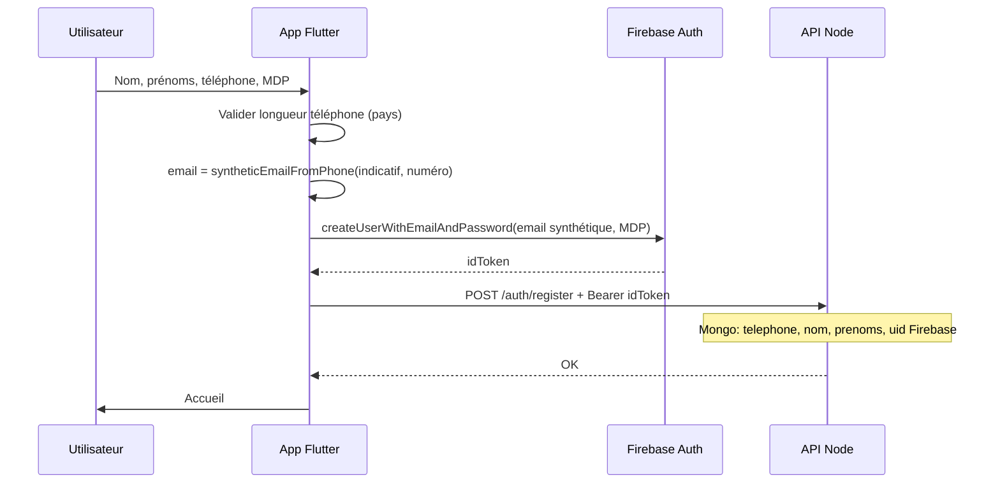
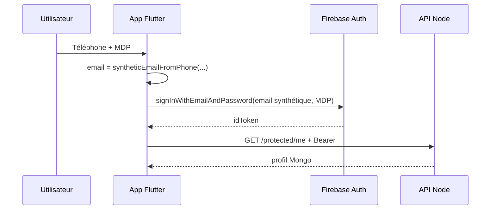

# Migration authentification : téléphone + mot de passe (sans email utilisateur)

Document de référence pour Tranoo — **tranoo** (acheteurs), **tranoo_pro** (vendeurs / livreurs / …), **tranoo_landing** (dashboard web), **tranoo-api** (Node + MongoDB + Firebase).

**Date** : mai 2026  
**Statut** : Phase 1 en cours — Phases 2 et 3 après stabilisation.

---

## 1. Objectif

| Aujourd’hui (utilisateur) | Cible |
|---------------------------|--------|
| Inscription / connexion avec **email** + mot de passe | **Numéro** (WhatsApp / mobile) + mot de passe |
| Mot de passe oublié par email | **OTP par notification push** (déjà en place sur mobile) — pas d’email |
| Email affiché dans profils et tableaux web | **Téléphone** comme identifiant visible ; email technique invisible |

**Ce qu’on ne supprime pas tout de suite** : Firebase Auth, FCM (push), Firebase Storage. On change **ce que l’utilisateur saisit**, pas tout l’écosystème d’un coup.

---

## 2. Pourquoi garder Firebase Auth en phase 1 ?

Firebase continue à :

- vérifier le mot de passe ;
- délivrer le **token** (`getIdToken()`) envoyé à l’API ;
- gérer la session sur les ~60+ écrans qui appellent déjà `FirebaseAuth.instance`.

**Email technique (invisible)** : pour chaque compte, Firebase a besoin d’un identifiant unique de type email. On utilise :

```
{indicatif}{numéro_national}@tranoo.app          → Tranoo (acheteur)
pro_{indicatif}{numéro_national}@tranoo.app      → Tranoo Pro (vendeur, livreur, …)
```

Exemples :
- Acheteur : `+229` + `97123456` → `22997123456@tranoo.app`
- Pro : `+229` + `97123456` → `pro_22997123456@tranoo.app`

**Même numéro sur les deux apps = deux comptes Firebase distincts** → pas de mélange de rôles ; la redirection « acheteur sur Tranoo / vendeur sur Pro » reste valide.

Fonction : `syntheticEmailFromPhone()` dans `tranoo_pro/lib/utils/phone_country_config.dart` (copie dans `tranoo/lib/utils/`).

| Couche | Rôle |
|--------|------|
| **Utilisateur** | Voit et saisit **téléphone + MDP** |
| **Firebase Auth** | Compte avec email synthétique + MDP |
| **MongoDB** | Profil métier : `telephone`, `nom`, `prenoms`, rôle, etc. |
| **API** | Vérifie toujours `verifyIdToken` (inchangé en phase 1) |

**Les tokens ne sont pas “cassés”** tant qu’on garde Firebase Auth avec cet email synthétique.

---

## 3. Les trois phases (recommandation validée)

### Phase 1 — Rapide, sans migration de comptes (~1 semaine)

**But** : plus d’email **visible** à l’inscription / connexion mobile ; comportement stable pour **nouveaux** comptes et connexion par téléphone.

| Zone | Actions |
|------|---------|
| **tranoo_pro** | Connexion : téléphone + MDP. Inscription : retirer champ email, email synthétique à l’envoi. Validation Bénin 8–10 chiffres. |
| **tranoo** | Idem (copie `phone_country_config.dart`). |
| **API** | Aucun changement obligatoire si `telephone` + `email` synthétique déjà acceptés à l’inscription. |
| **Firebase** | Inchangé (`createUserWithEmailAndPassword` / `signInWithEmailAndPassword` avec email synthétique). |
| **Reset MDP** | Garder flux **push OTP** existant (`pushOtpController`) — pas de reset par mail. |
| **Profils** | Peuvent encore afficher l’email technique en phase 1 (optionnel masquer). |

### Anciens comptes (email réel) — sans déconnexion forcée

| Question | Réponse |
|----------|---------|
| Déconnexion automatique ? | **Non.** Les sessions Firebase déjà ouvertes restent valides. |
| Casser l’existant ? | **Non**, si on garde la **connexion legacy** : sur l’écran connexion, si la saisie contient `@`, connexion **email + MDP** comme avant. |
| Alignement progressif | Option A (actuel) : legacy via email sur le même champ. Option B (plus tard) : dans le profil, « Associer mon numéro » → enregistre le téléphone ; migration admin si besoin. |
| Nouveaux comptes | Email technique `…@tranoo.app` ou `pro_…@tranoo.app` — jamais affiché ; messages d’erreur : **« Ce numéro est déjà utilisé »** (plus « email déjà utilisé »). |

**Inscription** : sélecteur de **pays** (plusieurs indicatifs).  
**Connexion** : sélecteur de **pays** également (même logique) — pas de Bénin figé.

### Séparation des rôles (apps)

| App | Rôles acceptés |
|-----|----------------|
| **Tranoo** (acheteur) | Uniquement `acheteur` |
| **Tranoo Pro** | `vendeur`, `chauffeur`, `transitaire`, `livreur`, `agentCommercial`, `admin`, etc. — **pas** `acheteur` |

Tout rôle Pro connecté sur Tranoo acheteur est refusé (pas seulement le vendeur).

### Configuration centralisée

| Fichier | Contenu |
|---------|---------|
| `tranoo/lib/utils/auth_config.dart` | MDP min 8, OTP 6 chiffres, nom app « Tranoo » |
| `tranoo_pro/lib/utils/auth_config.dart` | Idem pour « Tranoo Pro » |
| `src/config/authConfig.js` | OTP, MDP, session web 30 min (surcharge `.env`) |

Mot de passe oublié : vérification du numéro en BDD **avant** envoi WhatsApp ; après OTP validé, nouveau MDP (min. 8 caractères, comme inscription).

### Anciens comptes sans réinscription

Pas de risque immédiat : ils gardent leur email + MDP et la connexion **legacy** (`@` dans le champ).  
Risque **seulement** si l’utilisateur oublie qu’il avait un email et essaie uniquement le numéro sans migrer — d’où le libellé « numéro ou email (ancien compte) ».

### Phase 2 — Web + données affichées (~1 semaine)

**But** : le dashboard et les profils ne **dépendent plus** de l’email côté UX.

| Zone | Actions |
|------|---------|
| **tranoo_landing** | Login téléphone + MDP ; colonnes tableaux users/agents : **téléphone** au lieu d’email. |
| **Profils mobile** | Masquer champ email ; édition nom / prénoms / téléphone uniquement. |
| **API / exports** | Filtres et exports par `telephone` ; email reste en base pour admin technique si besoin. |

### Phase 3 — Après stabilisation (quand tu as le temps)

**But** : optionnel — JWT maison, retrait de Firebase Auth, un seul système de tokens.

- Middleware `verifyJwt` au lieu de `verifyIdToken`.
- Migration des comptes existants (mots de passe Firebase → hash Mongo ou “réinitialiser une fois”).
- FCM peut **rester** sans Firebase Auth.
- **WhatsApp OTP** : API Meta payante ; pas de solution gratuite fiable en production. Alternative gratuite actuelle : **FCM push** sur appareil connu.

---

## 4. WhatsApp OTP — attentes réalistes

| Canal | Auto-remplissage | Coût prod |
|-------|------------------|-----------|
| **SMS Firebase Phone Auth** | Oui (Android) | Payant (Google) |
| **WhatsApp Business API** | Limité | Payant (Meta) |
| **Push FCM (Tranoo actuel)** | Non (code dans l’app) | Gratuit avec FCM |

**Recommandation** : phase 1 = téléphone + MDP ; reset = push OTP déjà implémenté. WhatsApp en **évolution future** si budget API.

---

## 5. Processus détaillé — Inscription (phase 1)



**Backend** (`authController.register`) : continue d’enregistrer `email` (synthétique) + `telephone` (réel).

---

## 6. Processus détaillé — Connexion (phase 1)



**Anciens comptes** : connexion avec email réel + MDP (écran peut proposer “Utiliser mon email” en secours si besoin — option phase 2).

---

## 7. Processus — Mot de passe oublié (inchangé phase 1)

1. Utilisateur saisit le **numéro** sur l’écran reset.
2. Backend envoie **OTP par FCM** sur l’appareil déjà enregistré.
3. Utilisateur saisit OTP + nouveau MDP.
4. Backend met à jour Firebase Auth + hash Mongo.

Pas d’email utilisateur dans ce flux.

---

## 8. Fichiers impactés (checklist)

### Phase 1 — Mobile

- [x] `tranoo_pro/lib/utils/phone_country_config.dart`
- [x] `tranoo/lib/utils/phone_country_config.dart` (copie)
- [x] `tranoo_pro/lib/data/screens/connexion_page.dart`
- [x] `tranoo_pro/lib/data/screens/inscription_page.dart`
- [x] `tranoo/lib/data/screens/connexion_page.dart`
- [x] `tranoo/lib/data/screens/inscription_page.dart`
- [x] `tranoo_pro/lib/services/user_service.dart` — `loginWithPhone`
- [x] `tranoo/lib/services/user_service.dart` — `loginWithPhone`

### Phase 2 — Web + profils

- [ ] `tranoo_landing/app/login/page.tsx`
- [ ] Listes users / agents / articles (colonnes email)
- [ ] `profile.dart` / `profile2.dart` — masquer email

### Phase 3 — Auth maison

- [ ] `src/middlewares/auth.js`
- [ ] Migration utilisateurs + JWT

---

## 9. Tests manuels phase 1

1. **Inscription** Bénin : 8 chiffres, 10 chiffres, 9 chiffres (doit refuser).
2. **Connexion** avec le même numéro + MDP.
3. **Pas de champ email** visible à l’inscription.
4. **FCM** : token toujours envoyé après login.
5. **Reset MDP** par push (pas mail).
6. **Compte ancien** (email réel) : vérifier si connexion email encore possible (legacy).

---

## 10. Risques et rollback

| Risque | Mitigation |
|--------|------------|
| Utilisateur oublie qu’il avait un email réel | Garder connexion legacy email en phase 1 ou message d’aide |
| Doublon Firebase (même numéro, 2 formats) | Normaliser toujours `fullPhone` = indicatif + chiffres sans espaces |
| Email synthétique déjà pris | Traiter comme “compte existant” (Firebase `email-already-in-use`) |
| Rollback | Revenir aux écrans email ; comptes synthétiques restent valides |

---

## 11. Spinners sur l’accueil (marque) — hors auth

Le rafraîchissement auto **peut** se faire sans gros `CircularProgressIndicator` :

- **Premier chargement** : indicateur léger ou squelette si liste vide.
- **Rafraîchissement périodique (30–90 s)** : mode `silent: true` — met à jour les données **sans** `isLoading = true`.
- **Pull-to-refresh** : barre linéaire en haut (`AppRefreshShell`) plutôt que remplacer tout l’écran par un spinner.

Voir correctifs dans `marque.dart` (tranoo + tranoo_pro).

---

## 12. Ordre d’exécution convenu

1. **Ce document** — validé par l’équipe.
2. **Phase 1** — implémentation mobile + helpers (en cours).
3. **Phase 2** — après tests phase 1 sur preprod / prod pilote.
4. **Phase 3** — quand temps disponible et besoin confirmé (JWT / sans Firebase Auth).

---

*Mainteneur : mettre à jour ce fichier à chaque fin de phase (cocher la checklist).*
